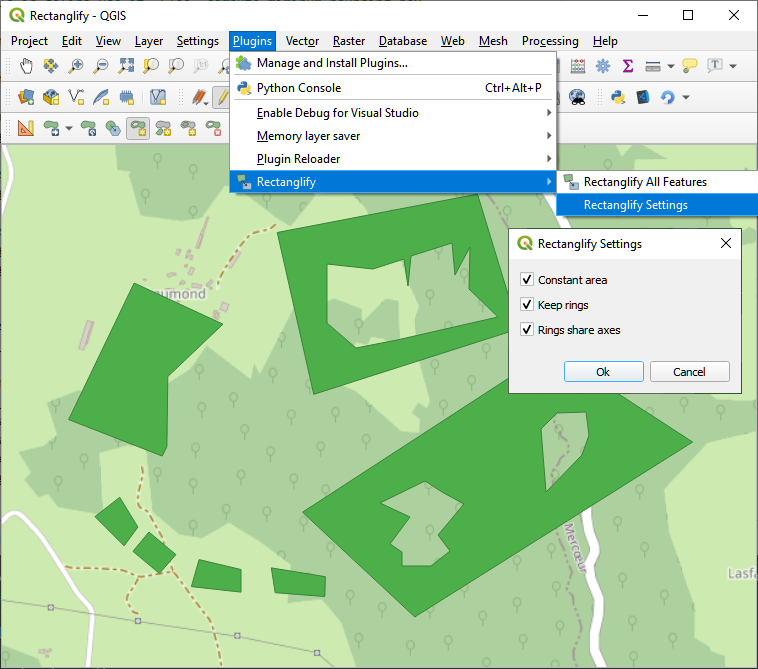
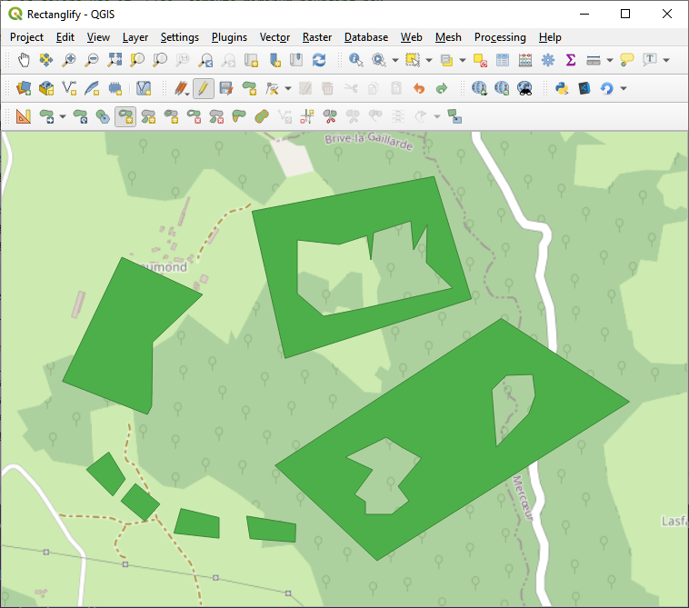
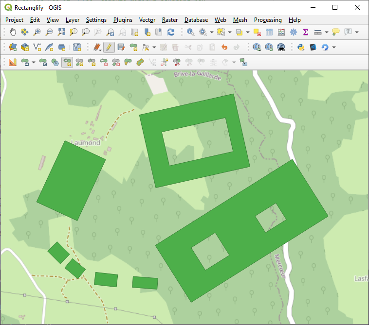
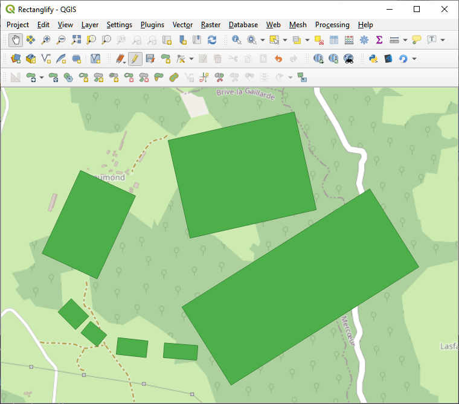

Rectanglify
===

This plugin adds a digitizing tool in the QGIS advanced digitizing toolbar and the QGIS Edit menu.

The tool is only enabled for in-edition polygon layers. Behavior depends whether any features are selected or not:

- No selected features: rectanglifies all features
- Some selected features: rectanglifies selected features

Rectanglify replaces each feature's geometry by its minimum oriented bounding box.

Note that it relies on a custom implementation of the obb, since the QGIS method [orientedMinimumBoundingBox](https://qgis.org/api/classQgsGeometry.html#a9572d5cf0714fa5fc377b36ed71335d8) was flawed until recently (https://github.com/qgis/QGIS/pull/34334)

Settings
--
Since version 1.0.3, its is possible to fine tune how the rectanglification is applied (in the Plugin Menu)

- **Constant area**: If enabled, rectanglify will scale down the mimimum oriented bounding box as to keep the same
- **Keep rings**: If enabled, rectanglify will try to rectanglify rings in feature geometries
- **Rings share axis**: If enabled, the rings will have the same orientation as the outer polygon

| Original           | `SharedAxes=True`  | `SharedAxes=False` | `KeepRings=False`  |
| ------------------ | ------------------ | ------------------ | ------------------ |
|  |  |  |  |

*Copyright © 2020 Yoann Quenach de Quivillic*

